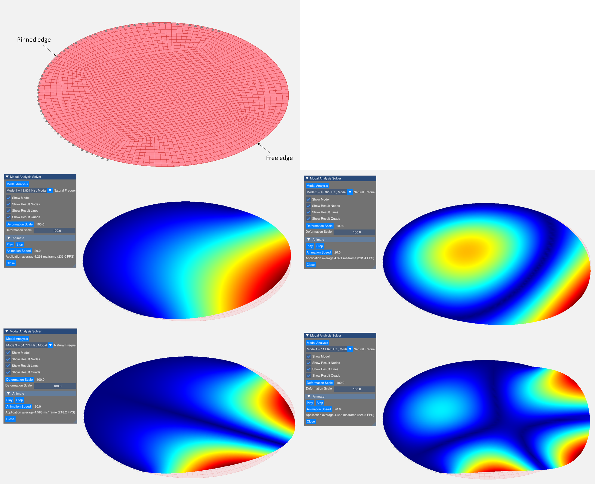
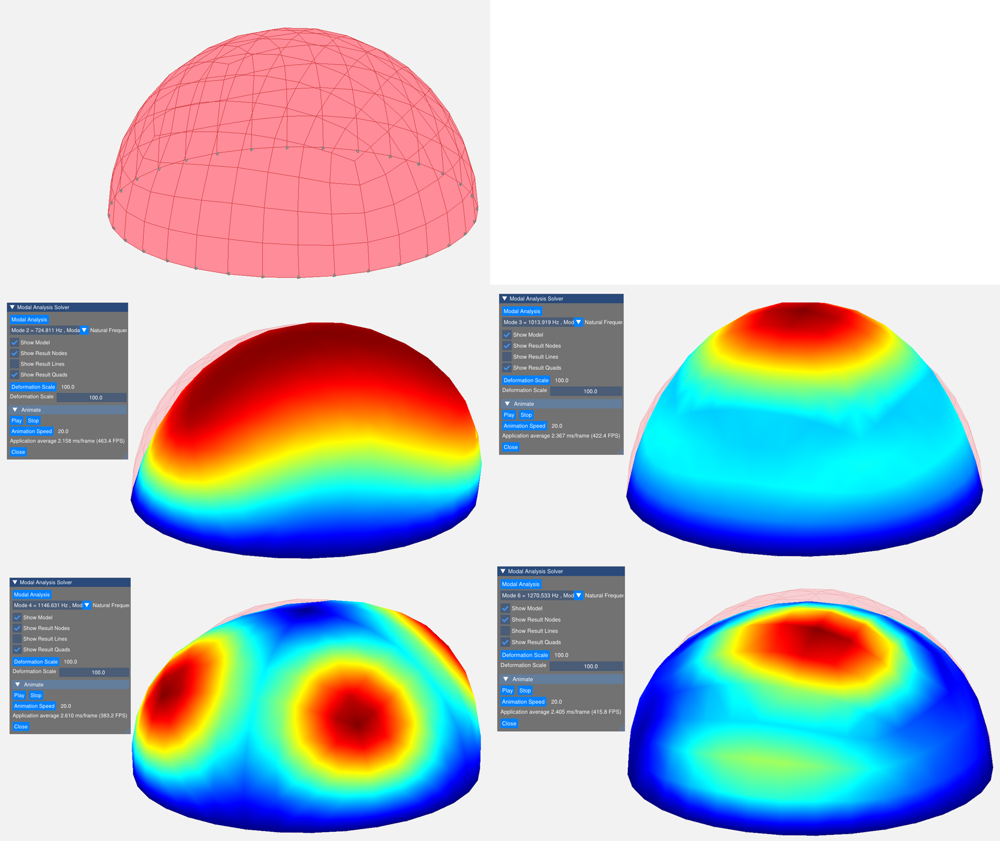

# Plate Vibration Analysis

## 📌 Overview

This repository contains a **C++ Finite Element Method (FEM) solver** for performing **modal analysis of plate (shell) structures**.

The implementation focuses on classical plate theory and standard FEM formulations, including:

- **Kirchhoff plate theory**
- **CTRIA3**: 3-node triangular element  
  - 9 DOF formulation  
  - Based on Cheung, King, and Zienkiewicz (CKZ)
- **CQUAD4 (MITC4)**: 4-node quadrilateral element

The solver computes natural frequencies and mode shapes using **ARPACK**, typically extracting the **lowest 20 modes**.

The input model format follows the **NASTRAN bulk data format**, and example models are provided in the repository.

---

## 🚀 Features

- ✅ Finite element modal analysis of plate/shell structures  
- ✅ Support for triangular and quadrilateral elements  
- ✅ NASTRAN-style input file support  
- ✅ Interactive visualization using OpenGL  

### 🎮 Visualization Controls

- **Rotate** → `Ctrl + Left Mouse Drag`  
- **Pan** → `Ctrl + Right Mouse Drag`  
- **Zoom** → `Ctrl + Mouse Scroll`  
- **Zoom to Fit** → `Ctrl + F`  

---

## 🖥️ Visualization

- OpenGL 3.3-based rendering
- Mode shape animation and deformation visualization
- GUI powered by ImGui

---

## 📦 Dependencies

Make sure the following libraries are installed:

- C++17 (or higher) compatible compiler
- [Eigen](https://eigen.tuxfamily.org/) – Linear algebra
- [GLFW](https://www.glfw.org/) – Window and input handling
- [GLEW](http://glew.sourceforge.net/) – OpenGL extension loader
- [ImGui](https://github.com/ocornut/imgui) – GUI framework
- [ARPACK](https://www.caam.rice.edu/software/ARPACK/) – Eigenvalue solver

---

## 📂 Input Format

- NASTRAN `.bdf` style input files
- Supports:
  - GRID (nodes)
  - CTRIA3 elements
  - CQUAD4 elements
  - Boundary conditions (constraints)

Example files are available in the repository.

---

## 📊 Examples

### Example 1: Circular Plate (Mixed Boundary)

- Half edge: **Pinned support**
- Half edge: **Free boundary**

First four mode shapes are shown below:



---

### Example 2: Circular Dome

- Edge: **Pinned support**

Selected vibration modes:



---

## ⚙️ Build Instructions

1. Clone the repository:

```bash
git clone https://github.com/Samson-Mano/Plate_Vibration_Analysis.git
cd Plate_Vibration_Analysis
